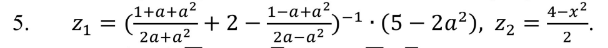
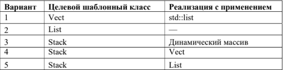
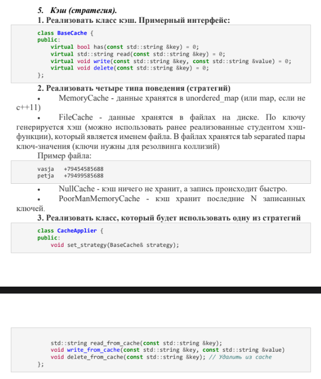

# OOPiP-2321-MIRONOV-
5 Вариант заданий
1lab - Создать шаблон класса «односторонняя очередь» (Queue)
2lab - 
3lab - Создать шаблонный класс smart-указателя ShPtr, реализующий
функционал shared_ptr.
4lab - 
(5 вариант)
5lab - Написать программу, печатающую все вводимые символы. В строку
выводится символ, шестнадцатеричный и восьмеричный код.
Записать выходной файл, разделив все нечетные по абсолютной
величине числа на среднее арифметическое.
6lab - 
7lab - Реализовать для своей программы, созданной в рамках лабораторной работы 4 , итераторы - 2 класса. Один для обхода, например, положительных элементов коллекции,
второй - отрицательных; или один для обхода коллекции в одну сторону, второй в другую (один для обхода дерева сверху вниз, второй слева направо).
Предусмотреть исключительные ситуации и их обработку (например обращение к элементу коллекции, если она пустая).
Для обработки исключений использовать ранее реализованный класс CustomException. Создать общий интерфейс для работы с итераторами. 